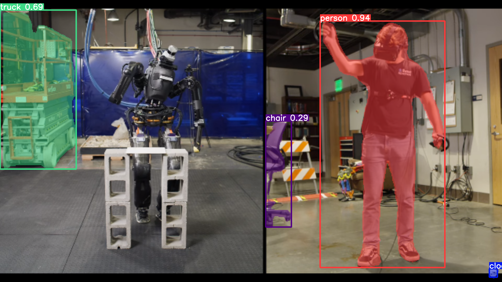

# YOLOv9

<div align="center">
    <a href="./">
        
    </a>
</div>

## System Requirement
The system is tested on Ubuntu 20.04 with Nvidia RTX 3060, Graphics Driver 535 and cuda 11.3.

## Setup
Clone the repo:
```shell
git clone https://github.com/ArghyaChatterjee/yolov9.git
```

## Installation

### Docker environment (recommended):

``` shell
# create the docker container, you can change the share memory size if you have more.
nvidia-docker run --name yolov9 -it -v your_coco_path/:/coco/ -v your_code_path/:/yolov9 --shm-size=64g nvcr.io/nvidia/pytorch:21.11-py3

# apt install required packages
apt update
apt install -y zip htop screen libgl1-mesa-glx

# pip install required packages
pip install seaborn thop

# go to code folder
cd /yolov9
```
### Using Virtual Environement:
```shell
cd yolov9
python3 -m venv yolo_v9_venv
source yolo_v9_venv/bin/activate
pip3 install --upgrade pip
pip3 install -r requirements.txt
```
</details>

## Preexisting Trained Models
- Detection: [`gelan-c-det.pt`](https://github.com/WongKinYiu/yolov9/releases/download/v0.1/gelan-c-det.pt)
- Instance Segmentation: [`gelan-c-seg.pt`](https://github.com/WongKinYiu/yolov9/releases/download/v0.1/gelan-c-seg.pt)
- Panoptic Segmentation: [`gelan-c-pan.pt`](https://github.com/WongKinYiu/yolov9/releases/download/v0.1/gelan-c-pan.pt)


## Single Image Testing 
Download the preexisting trainied models, create a new folder inside the yolov9 and put them there. Your folder should look like this:
```
yolov9
  - weights
    - gelan-c-seg.pt
    - yolov9-c-converted.pt
```

### Detection Model
Activate the virtual env and run the inference:
```shell
cd yolov9
source yolo_v9_venv/bin/activate
python3 detect/detect.py --source './data/images/horses.jpg' --img 640 --device 0 --weights './weights/yolov9-c-converted.pt' --name yolov9_c_c_640_detect
# inference yolov9 models
# python detect/detect_dual.py --source './data/images/horses.jpg' --img 640 --device 0 --weights './weights/yolov9-c.pt' --name yolov9_c_640_detect

# inference gelan models
# python detect.py --source './data/images/horses.jpg' --img 640 --device 0 --weights './weights/gelan-c.pt' --name gelan_c_c_640_detect
```

### Segmentation Model
Activate the virtual env and run the inference:
```shell
cd yolov9
source yolo_v9_venv/bin/activate
python3 segment/predict.py --source './data/images/horses.jpg' --weights './weights/gelan-c-seg.pt' --conf-thres 0.25 --iou-thres 0.45 --imgsz 640 640 --device 0
```

### Panoptic Segmentation Model
Activate the virtual env and run the inference:
```shell
cd yolov9
source yolo_v9_venv/bin/activate
python3 detect.py --source './data/images/horses.jpg' --img 640 --device 0 --weights './weights/yolov9-c-converted.pt' --name yolov9_c_c_640_detect
```

### Webcam demo
### Detection Model
Activate the virtual env and run the inference:
```shell
cd yolov9
source yolo_v9_venv/bin/activate
python3 detect/predict_webcam.py
``` 

### Segmentation Model
Activate the virtual env and run the inference:
```shell
cd yolov9
source yolo_v9_venv/bin/activate
python3 segment/predict_webcam.py
``` 

### Panoptic Segmentation Model
Activate the virtual env and run the inference:
```shell
cd yolov9
source yolo_v9_venv/bin/activate
python3 panoptic/predict_webcam.py
``` 

## Training

### Data preparation:

``` shell
bash scripts/get_coco.sh
```

* Download MS COCO dataset images ([train](http://images.cocodataset.org/zips/train2017.zip), [val](http://images.cocodataset.org/zips/val2017.zip), [test](http://images.cocodataset.org/zips/test2017.zip)) and [labels](https://github.com/WongKinYiu/yolov7/releases/download/v0.1/coco2017labels-segments.zip). If you have previously used a different version of YOLO, we strongly recommend that you delete `train2017.cache` and `val2017.cache` files, and redownload [labels](https://github.com/WongKinYiu/yolov7/releases/download/v0.1/coco2017labels-segments.zip) 

Single GPU training:

``` shell
# train yolov9 models
python train_dual.py --workers 8 --device 0 --batch 16 --data data/coco.yaml --img 640 --cfg models/detect/yolov9-c.yaml --weights '' --name yolov9-c --hyp hyp.scratch-high.yaml --min-items 0 --epochs 500 --close-mosaic 15

# train gelan models
# python train.py --workers 8 --device 0 --batch 32 --data data/coco.yaml --img 640 --cfg models/detect/gelan-c.yaml --weights '' --name gelan-c --hyp hyp.scratch-high.yaml --min-items 0 --epochs 500 --close-mosaic 15
```

Multiple GPU training:

``` shell
# train yolov9 models
python -m torch.distributed.launch --nproc_per_node 8 --master_port 9527 train_dual.py --workers 8 --device 0,1,2,3,4,5,6,7 --sync-bn --batch 128 --data data/coco.yaml --img 640 --cfg models/detect/yolov9-c.yaml --weights '' --name yolov9-c --hyp hyp.scratch-high.yaml --min-items 0 --epochs 500 --close-mosaic 15

# train gelan models
# python -m torch.distributed.launch --nproc_per_node 4 --master_port 9527 train.py --workers 8 --device 0,1,2,3 --sync-bn --batch 128 --data data/coco.yaml --img 640 --cfg models/detect/gelan-c.yaml --weights '' --name gelan-c --hyp hyp.scratch-high.yaml --min-items 0 --epochs 500 --close-mosaic 15
```

## Re-parameterization

See [reparameterization.ipynb](https://github.com/WongKinYiu/yolov9/blob/main/tools/reparameterization.ipynb).


#### Object Detection

``` shell
# coco/labels/{split}/*.txt
# bbox or polygon (1 instance 1 line)
python train.py --workers 8 --device 0 --batch 32 --data data/coco.yaml --img 640 --cfg models/detect/gelan-c.yaml --weights '' --name gelan-c-det --hyp hyp.scratch-high.yaml --min-items 0 --epochs 300 --close-mosaic 10
```

#### Instance Segmentation

``` shell
# coco/labels/{split}/*.txt
# polygon (1 instance 1 line)
python segment/train.py --workers 8 --device 0 --batch 32  --data coco.yaml --img 640 --cfg models/segment/gelan-c-seg.yaml --weights '' --name gelan-c-seg --hyp hyp.scratch-high.yaml --no-overlap --epochs 300 --close-mosaic 10
```

#### Panoptic Segmentation

``` shell
# coco/labels/{split}/*.txt
# polygon (1 instance 1 line)
# coco/stuff/{split}/*.txt
# polygon (1 semantic 1 line)
python panoptic/train.py --workers 8 --device 0 --batch 32  --data coco.yaml --img 640 --cfg models/panoptic/gelan-c-pan.yaml --weights '' --name gelan-c-pan --hyp hyp.scratch-high.yaml --no-overlap --epochs 300 --close-mosaic 10
```

<!--[`gelan-c-cap.pt`]()-->

`object detection` `instance segmentation` `semantic segmentation` `stuff segmentation` `panoptic segmentation` `image captioning`

``` shell
# coco/labels/{split}/*.txt
# polygon (1 instance 1 line)
# coco/stuff/{split}/*.txt
# polygon (1 semantic 1 line)
# coco/annotations/*.json
# json (1 split 1 file)
python caption/train.py --workers 8 --device 0 --batch 32  --data coco.yaml --img 640 --cfg models/caption/gelan-c-cap.yaml --weights '' --name gelan-c-cap --hyp hyp.scratch-high.yaml --no-overlap --epochs 300 --close-mosaic 10
```

## Evaluation

[`yolov9-c-converted.pt`](https://github.com/WongKinYiu/yolov9/releases/download/v0.1/yolov9-c-converted.pt) [`yolov9-e-converted.pt`](https://github.com/WongKinYiu/yolov9/releases/download/v0.1/yolov9-e-converted.pt) [`yolov9-c.pt`](https://github.com/WongKinYiu/yolov9/releases/download/v0.1/yolov9-c.pt) [`yolov9-e.pt`](https://github.com/WongKinYiu/yolov9/releases/download/v0.1/yolov9-e.pt) [`gelan-c.pt`](https://github.com/WongKinYiu/yolov9/releases/download/v0.1/gelan-c.pt) [`gelan-e.pt`](https://github.com/WongKinYiu/yolov9/releases/download/v0.1/gelan-e.pt)

``` shell
# evaluate converted yolov9 models
python val.py --data data/coco.yaml --img 640 --batch 32 --conf 0.001 --iou 0.7 --device 0 --weights './yolov9-c-converted.pt' --save-json --name yolov9_c_c_640_val

# evaluate yolov9 models
# python val_dual.py --data data/coco.yaml --img 640 --batch 32 --conf 0.001 --iou 0.7 --device 0 --weights './yolov9-c.pt' --save-json --name yolov9_c_640_val

# evaluate gelan models
# python val.py --data data/coco.yaml --img 640 --batch 32 --conf 0.001 --iou 0.7 --device 0 --weights './gelan-c.pt' --save-json --name gelan_c_640_val
```